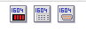
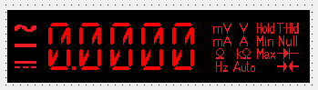
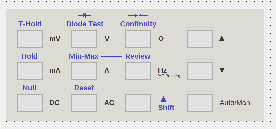

# TPTIndustrial

TPTIndustrial makes easy to connect test equipments.

**Current version:** 0.1.00

### Available components:
 -  TTTi1604DsplPanel
 -  TTTi1604ButtonPanel
 -  TTTi1604Comm

### Required packages:
   - laz_synapse - for serial communication
   - industrial - for LED display

## Installation
1. Download repository
2. In Lazarus Package/Open package
3. In the Package editoe click Compile
4. In the Package editor Use/Install
5. recompile Lazarus
6. Your new components vill be visible on the Components palette PetiTech tab 

# Components description
### TTTi1604DsplPanel

Offers full compatible display. Looks and feels like just the real hardware.
  - Sizeable
  - Signs can be hidden
  - Direct control from TTTi1604Comm

#### New properties and Methodes:
##### Properties:
- **NoSign** - If True Signs will not be visiable. The panel will be narrower.Usefull if You vant see just the numbers.
- **Signs** - enumerated list of signs
- **Size** - Size of display between 1 and 9. Works same as TLedNumber/Size
- **Text** - string representative of displayed number
- **Value** - Double type representative of displayed number

##### Methodes:
No added methode.
### TTTi1604ButtonPanel

Offers full control of multimeter.
 - Sizeable
 - Direct control via TTTi1604Comm

#### New properties and Methodes:
##### Properties:
- **Button** - Integer type representative of pressed button
- **SerialComm** - interface of TTTi1604Comm component
- **Size** - Size of button panel between 1 and 9.

##### Methodes:
- **onButtonClick** - activates when a button was clicked

### TTTi1604Comm

Offers full communication layer.
 - Can control TTTiDsplPanel directly
 - Can send commands from TTTiButtonPanel

#### New properties and Methodes:
##### Properties:
- **Port** - The used serial port. Ex: On Windows com1, on Linux /dev/TTyS1
- **Active** - Boolean property, Activate/Deactivate communication
- **Display** - Control TTi1604DsplPanel directly
- **OffMsg** - Visible text when Active=false

##### Methodes:
No added methode.

## Known bugs and limitations:
Currently tested on Windows (XP,7,10) only.

